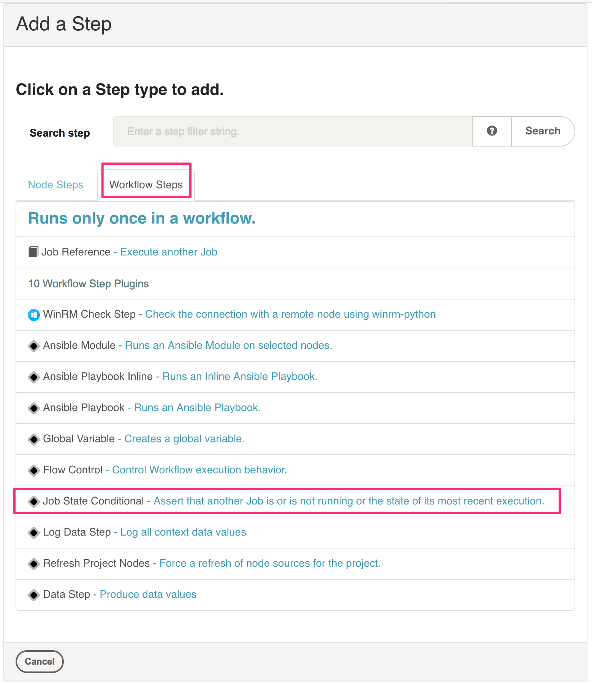
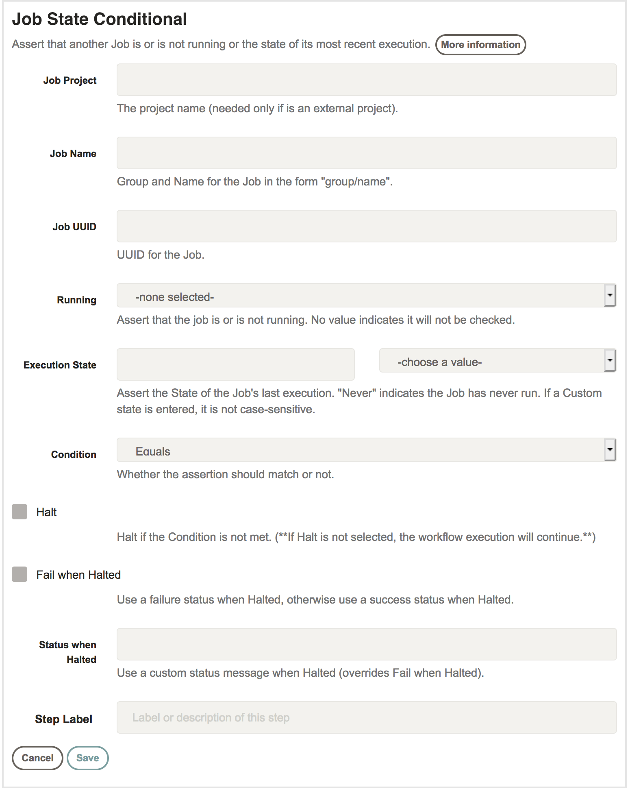

# Job State Plugin

A Rundeck plugin that can assert that another job is or is not running or the state of its most recent execution.

### Usage

Create a new job and select this plugin when creating a workflow step.

Configure the plugin with the form.

